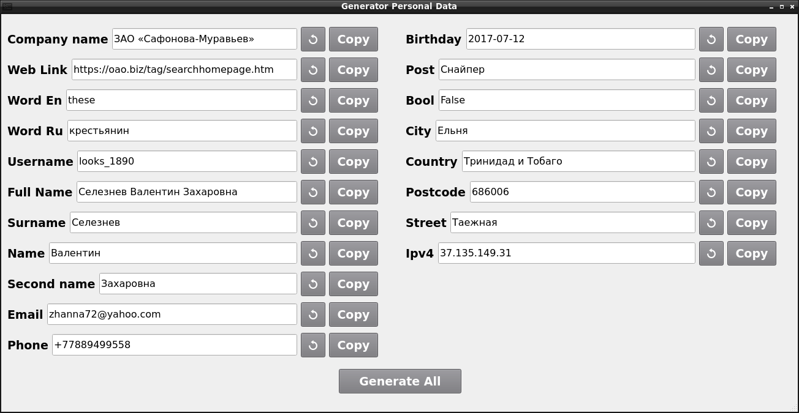

# GeneratorPersonalData

Программа генерирующая случайные персональные данные с возможностью перегенерации и копирования в буфер обмена



## Варианты запуска
- python.exe .\main.py 
- Запустить через [start_programm_linux](start_programm_linux.sh) или [start_programm_windows](start_programm_windows.ps1) (Если используется venv)
- Программу можно запустить через [GeneratorPersonalData.exe](dist/GeneratorPersonalData.exe.lnk)
- Собрать из исходников:
```commandline
pyinstaller .\main.py --noconsole
```
